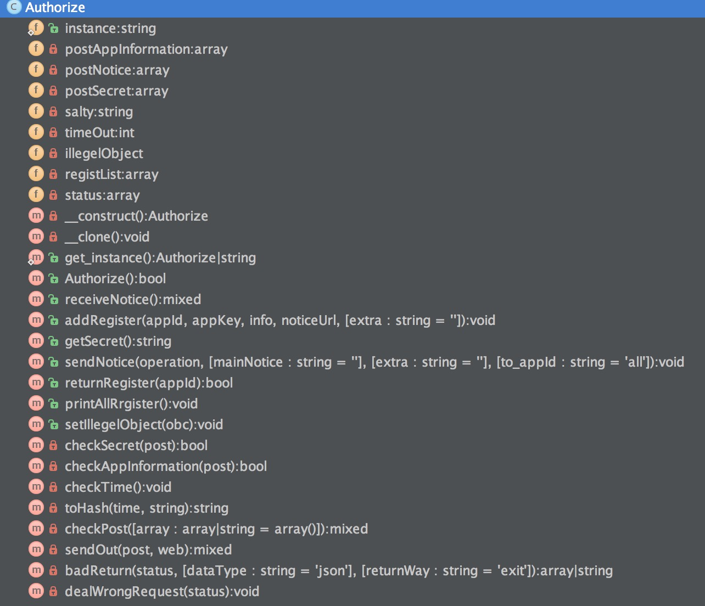

#	授权验证插件用户手册
 - Git:https://github.com/Orange-W/learning/tree/master/myAuthorize
 - Just long for a star~如果觉得还不错，就给我点个赞加颗星吧～
 
##	一、函数与变量目录结构

##二、公共函数介绍
### get_instance（）: 单例模式初始化函数
 - 参数:无
 - return : 无

### Authorize（）: 授权验证函数
 - 参数:无
 - 调用: $Obc->Authorize()
 - return : true/false

### receiveNotice() : 接收推送,和sendNotice对应
 - 参数:无
 - return : 无

### addRegister($appId,$appKey,$info,$noticeUrl,$extra='') : 注册应用
 - 参数:
 <br><font color="gree" style="margin-right:25px;">appId</font> app唯一识别码
 <br><font color="gree" style="margin-right:25px;">appKey</font> app密钥
 <br><font color="gree" style="margin-right:25px;">info</font> appx信息介绍
 <br><font color="gree" style="margin-right:25px;">noticeUrl</font> 推送的app地址
 <br><font color="gree" style="margin-right:25px;">extra</font> 用户自定义附加信息
 - return : 无

###getSecret() : 反回参数与密钥
 - 参数:无
 - return >> array
  <br><font color="gree" style="margin-right:25px;"> secret </font> 密钥 
  <br><font color="gree" style="margin-right:25px;"> time </font> 时间戳
  <br><font color="gree" style="margin-right:25px;"> string </font> 随机字符串

###sendNotice($operation,$mainNotice='',$extra='',$to_appId='all') : 给授权应用发送推送信息
 - 参数:
  <br><font color="gree" style="margin-right:25px;"> operation </font> app操作码(自定义协议)
 <br><font color="gree" style="margin-right:25px;"> mainNotice </font> 推送主消息
 <br><font color="gree" style="margin-right:25px;"> extra </font> 附加信息
 - return : 无

###returnRegister($appId) : 返回注册应用
 - 参数:
  <br><font color="gree" style="margin-right:25px;"> appId </font> 唯一识别码
 - return >> array
  <br><font color="gree" style="margin-right:25px;"> app </font> 所有app信息
  
###printAllRrgister() : 打印所有注册用户
 - 参数:无
 - return : 无

###setIllegelObject($obc) : 设置自定义错误处理类(默认没有)
 - 参数:
  <br><font color="gree" style="margin-right:25px;"> Obc </font> 自定义错误类
 - return : 无
 - 备注:默认调用自定义错误类dealWrongRequest函数<附带参数:status 错误码>
 
 ## 三、私有函数

###checkSecret($post):检测post的密钥
###checkAppInformation($post):确认请求的appId与appKey是否合法
###checkTime():请求是否过期(默认5分钟内)
###toHash($time,$string):生成密钥
###checkPost($array=array()):检测是否存在必要post参数
###sendOut($post,$web):curl推送app信息


##四、错误处理
###badReturn($status,$dataType='json',$returnWay='exit'):自定义报错
 - 默认错误码:
		  <section>
		 '-1'    =>  'illegal operation!',
        <br>'404'   =>  '404 not find',
        <br>'405'   =>  'Data wrong!',
        <br>'707'   =>  'Parameter lost!',
        <br>'708'   =>  'Parameter wrong!',
        <br>'709'   =>  'App information wrong!',
        <br>'801'   =>  'Time out!',
        <br>'804'   =>  'illegal request, ban this IP.',
        <br>'901'   =>  'appId repeat!',
        </section>
        
###dealWrongRequest($status):自定义错误类例子(无实用性)

##五、代码Demo

###①初始化授权类
```
$Yz = Authorize::get_instance();//全局性
```
###③注册app用户
```
$Yz->addRegister('123','exampleAppKey','http://localhost/au/Yz.php','测试的额外信息');
$Yz->addRegister('hkj798HSuiha7hkM','exampleAppKey2','http://localhost/au/Yz.php','','测试的额外信息');
$Yz->addRegister('us898J898lsoPVC','exampleAppKey3','http://localhost/au/Yz.php','','测试的额外信息');
```
###④获取值用户信息(两种)
```
print_r($Yz->returnRegister('hkj798HSuiha7hkM'));
/** next one **/
$Yz->printAllRrgister();
```
###⑤生成密钥
```
$arr = $Yz->getSecret();
```
###推送信息
```
/** 全体推送(默认) **/
$Yz->sendNotice('changeImg','helloWorld','测试信息');
/** 固定推送 **/
$Yz->sendNotice('操作码','主推送消息','额外信息',$to_appId=array('appId1','appId2','其他appId'));

```
 
 
###附录:自定义错误处理类操作
 ```
 $Yz = Authorize::get_instance();//全局性
 $Yz -> setIllegelObject(new myIllegeClass());
 /** 可以传入验证类,反相调用内部的一些函数. **/
 //$Yz -> setIllegelObject(new myIllegeClass($Yz));
 ```
####自定义错误类要实现dealWrongRequest函数
 错误机制会自动调用此函数,操作写在里面即可
 
```
 class myIllegeClass(){
 		public dealWrongRequest($status){
 		   //$status : 错误码
 		}
 }
``` 
```
/** 错误机制调用dealWrongRequest源码 **/
if($this->illegelObject!=null) 
$this->illegelObject->dealWrongRequest($status);
```

 


